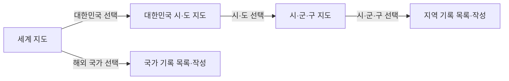
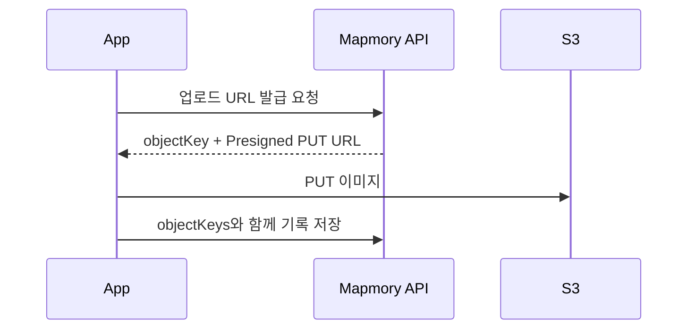

# Mapmory MVP API 명세

> 기준일: 2026-08-07 · 범위: 지도 색칠, 여행 기록, 이미지 첨부

## 1. 빠른 참조

| 구분 | 값 |
| --- | --- |
| Base URL | `/api/v1` |
| 요청·응답 | 성공은 `application/json`, 오류는 `application/problem+json` |
| 날짜 | `YYYY-MM-DD` |
| 시간 | ISO 8601 offset datetime. 예: `2026-07-13T09:30:00+09:00` |
| 임시 사용자 식별 | `X-Member-Id: {memberId}` 요청 헤더 |
| 목록 페이징 | `page` 기본 0, `size` 기본 20·최대 100 |

로그인 전에는 사용자별 API에 `X-Member-Id`를 보낸다. 이 값은 임시 식별자이며 인증 수단이 아니다. 정식 로그인 도입 시 헤더를 제거하고 Access Token에서 회원 ID를 식별한다.

여행 기록은 비공개다. 본인 기록만 조회·수정·삭제할 수 있으며, 타인 기록 접근은 존재 여부를 숨기기 위해 `404 TRAVEL_RECORD_NOT_FOUND`를 반환한다.

### 응답 형식

```json
{ "data": {} }
```

```json
{
  "title": "요청 값이 올바르지 않습니다.",
  "status": 400,
  "detail": "1개의 값이 유효하지 않습니다.",
  "instance": "/api/v1/travel-records",
  "code": "VALIDATION_ERROR",
  "errors": [{ "field": "title", "detail": "필수 값입니다." }]
}
```

오류 응답은 RFC 9457 Problem Details 형식을 사용한다. `errors`는 입력값 검증 실패일 때만 반환하며, 그 외 오류에서는 생략한다. `type`을 생략하면 기본값은 `about:blank`다.

| 상태 | 사용 예 |
| --- | --- |
| `200 OK` | 조회·수정 성공 |
| `201 Created` | 생성 성공 |
| `204 No Content` | 삭제 성공 |
| `400 Bad Request` | 형식·유효성·업무 규칙 오류 |
| `401 Unauthorized` | 정식 인증 도입 후 인증 필요 |
| `403 Forbidden` | 정식 인증 도입 후 권한 없음 |
| `404 Not Found` | 리소스 없음 또는 타인 기록 |
| `409 Conflict` | 업로드 상태 충돌 |

## 2. API 목록

`*`는 `X-Member-Id`가 필요한 API다.

| Method | Endpoint | 설명 |
| --- | --- | --- |
| `GET` | `/countries` | 국가 목록 |
| `GET` | `/locations` | 시·도 또는 시·군·구 목록 |
| `GET` | `/locations/{locationId}` | 지역 상세 |
| `GET` | `/logs/summary` * | 지도 범주별 기록 수·색칠 단계 |
| `POST` | `/uploads/presigned-urls` * | S3 이미지 업로드 URL 발급 |
| `POST` | `/travel-records` * | 여행 기록 생성 |
| `GET` | `/travel-records` * | 내 기록 목록 |
| `GET` | `/travel-records/{travelRecordId}` * | 내 기록 상세 |
| `PUT` | `/travel-records/{travelRecordId}` * | 내 기록 전체 수정 |
| `DELETE` | `/travel-records/{travelRecordId}` * | 내 기록 삭제 |
| `GET` | `/members/{memberId}` | 임시 회원 상세 |

## 3. 지도·기록 규칙



| 기록 대상 | 작성 규칙 | 색칠 규칙 |
| --- | --- | --- |
| 해외 국가 | `countryId`만 전달 | 세계 지도에서 해당 국가 색칠 |
| 대한민국 시·도 | 직접 기록 불가 | 하위 시·군·구에 기록이 있으면 색칠 |
| 대한민국 시·군·구 | `countryId=KR`, `locationId` 전달 | 해당 시군구·상위 시도·세계 지도의 대한민국 색칠 |

- 해외에서는 MVP 기준 국가 단위 기록만 지원한다.
- `locationId`는 대한민국의 `DISTRICT`만 허용한다. `PROVINCE`는 직접 기록할 수 없다.
- 지도 API의 `count`는 해당 범주와 하위 범주의 내 기록 수다.
- `level`은 앱이 지도 색 농도를 결정할 때 사용할 서버 제공 단계(1~3)다. `count → level` 변환 기준은 클라이언트·서버 구현 전에 확정한다.

## 4. 국가·지역 API

### 국가 목록 — `GET /countries`

```json
{
  "data": [{ "id": 1, "code": "KR", "name": "대한민국" }]
}
```

### 지역 목록 — `GET /locations`

`countryId` 또는 `parentId` 중 하나만 전달한다.

| Query | 타입 | 필수 | 설명 |
| --- | --- | --- | --- |
| `countryId` | Long | 조건부 | 해당 국가의 시·도 조회. MVP에서는 `KR`만 허용 |
| `parentId` | Long | 조건부 | 특정 시·도의 시·군·구 조회 |
| `keyword` | String | 아니요 | 지역명 또는 지역 코드 검색 |

```http
GET /api/v1/locations?parentId=101
```

```json
{
  "data": [{
    "id": 201,
    "countryId": 1,
    "parentId": 101,
    "regionCode": "50110",
    "name": "제주시",
    "locationType": "DISTRICT"
  }]
}
```

### 지역 상세 — `GET /locations/{locationId}`

지역 객체를 반환한다. 존재하지 않으면 `404 LOCATION_NOT_FOUND`를 반환한다.

## 5. 지도 요약 API

### 지도 색칠 데이터 — `GET /logs/summary`

현재 회원의 기록을 지도 범주별로 집계한다. 앱은 `code`를 Mapbox 경계 데이터의 코드(`iso_3166_1` 등)와 연결해 영역을 색칠한다.

| Query | 타입 | 필수 | 규칙 |
| --- | --- | --- | --- |
| `locationType` | String | 예 | `COUNTRY`, `PROVINCE`, `DISTRICT` 중 하나 |
| `parentId` | Long | 조건부 | `PROVINCE`는 대한민국 국가 ID, `DISTRICT`는 시·도 ID를 전달. `COUNTRY`는 생략 |

#### 세계 지도

```http
GET /api/v1/logs/summary?locationType=COUNTRY
```

```json
{
  "data": [
    { "locationId": 1, "code": "KR", "name": "대한민국", "count": 12, "level": 3 },
    { "locationId": 15, "code": "JP", "name": "일본", "count": 5, "level": 2 }
  ]
}
```

#### 대한민국 시·도 지도

```http
GET /api/v1/logs/summary?locationType=PROVINCE&parentId=1
```

```json
{
  "data": [
    { "locationId": 101, "code": "11", "name": "서울특별시", "count": 5, "level": 2 },
    { "locationId": 102, "code": "26", "name": "부산광역시", "count": 2, "level": 1 }
  ]
}
```

#### 시·군·구 지도

```http
GET /api/v1/logs/summary?locationType=DISTRICT&parentId=101
```

```json
{
  "data": [{ "locationId": 1101, "code": "11110", "name": "종로구", "count": 3, "level": 2 }]
}
```

`locationType`과 `parentId` 조합이 유효하지 않으면 `400 INVALID_LOCATION_QUERY`를 반환한다.

## 6. 이미지 업로드 API

이미지는 API 서버를 거치지 않고 S3로 직접 전송한다. 서버가 UUID 기반 `objectKey`를 만들며 클라이언트 파일명은 키로 사용하지 않는다.



### Presigned URL 발급 — `POST /uploads/presigned-urls`

```json
{
  "files": [{
    "fileName": "seoul-trip.jpg",
    "contentType": "image/jpeg",
    "fileSize": 3145728
  }]
}
```

| 필드 | 타입 | 필수 | 규칙 |
| --- | --- | --- | --- |
| `files` | Array | 예 | 1개 이상 |
| `files[].fileName` | String | 예 | 확장자·로그 표시용 원본 파일명 |
| `files[].contentType` | String | 예 | 허용 이미지 MIME 타입 |
| `files[].fileSize` | Long | 예 | 바이트 단위 |

```json
{
  "data": {
    "uploads": [{
      "objectKey": "mapmory/travel-records/10/550e8400-e29b-41d4-a716-446655440000.jpg",
      "presignedUrl": "https://...",
      "method": "PUT",
      "contentType": "image/jpeg",
      "expiresIn": 300
    }]
  }
}
```

앱은 응답 URL에 아래처럼 요청한다. 응답 `contentType`과 동일한 헤더를 사용해야 한다.

```http
PUT {presignedUrl}
Content-Type: image/jpeg
```

DB에는 Presigned URL이 아닌 `objectKey`만 저장한다. 발급·업로드 후 24시간 안에 기록에 연결되지 않은 객체는 고아 객체로 정리한다.

| 오류 코드 | 조건 |
| --- | --- |
| `INVALID_FILE_TYPE` | 허용하지 않는 MIME 타입 |
| `FILE_SIZE_EXCEEDED` | 파일 크기 초과 |
| `TOO_MANY_FILES` | 한 번에 발급할 수 있는 개수 초과 |
| `MEMBER_NOT_FOUND` | 회원이 없음 |

## 7. 여행 기록 API

### 요청 규칙

생성과 수정은 같은 본문을 사용하며, 수정은 전체 교체(`PUT`)다.

```json
{
  "countryId": 1,
  "locationId": 201,
  "title": "비 오는 날의 제주시",
  "content": "골목을 걸으며 오래된 가게들을 기록했다.",
  "startDate": "2026-07-10",
  "endDate": "2026-07-12",
  "objectKeys": ["mapmory/travel-records/10/550e8400-e29b-41d4-a716-446655440000.jpg"]
}
```

| 필드 | 타입 | 필수 | 규칙 |
| --- | --- | --- | --- |
| `countryId` | Long | 예 | 존재하는 국가 ID |
| `locationId` | Long | 조건부 | 대한민국이면 필수이며 `DISTRICT`만 허용. 해외면 생략 |
| `title` | String | 예 | 최대 200자. `null` 불가, 빈 문자열·공백 허용 |
| `content` | String | 예 | `null` 불가, 빈 문자열·공백 허용 |
| `startDate` | LocalDate | 아니요 | 시작일만 있으면 종료일에 같은 날짜 저장 |
| `endDate` | LocalDate | 아니요 | 단독 입력 불가, 시작일보다 이를 수 없음 |
| `objectKeys` | String[] | 아니요 | 업로드 완료된 본인 소유 키. 배열 순서가 이미지 순서 |

### 생성 — `POST /travel-records`

성공 시 `201 Created`와 `Location: /api/v1/travel-records/{id}`를 반환한다.

```json
{ "data": { "id": 101 } }
```

### 목록 — `GET /travel-records`

내 기록만 `id DESC`로 반환한다.

| Query | 타입 | 필수 | 설명 |
| --- | --- | --- | --- |
| `countryId` | Long | 아니요 | 국가 필터 |
| `provinceId` | Long | 아니요 | 시·도의 하위 시·군·구 기록 필터 |
| `locationId` | Long | 아니요 | 시·군·구 필터 |
| `keyword` | String | 아니요 | 제목·본문 검색 |
| `page`, `size` | Integer | 아니요 | 공통 페이징 규칙 적용 |

```json
{
  "data": {
    "items": [{
      "id": 101,
      "country": { "id": 1, "code": "KR", "name": "대한민국" },
      "location": { "id": 201, "regionCode": "50110", "name": "제주시", "locationType": "DISTRICT" },
      "title": "비 오는 날의 제주시",
      "startDate": "2026-07-10",
      "endDate": "2026-07-12",
      "thumbnailUrl": "https://...",
      "thumbnailUrlExpiresIn": 300,
      "createdAt": "2026-07-13T09:30:00+09:00",
      "updatedAt": "2026-07-13T09:30:00+09:00"
    }],
    "page": 0,
    "size": 20,
    "totalElements": 1,
    "totalPages": 1,
    "hasNext": false
  }
}
```

해외 국가 기록은 `location: null`이다. 이미지가 없으면 `thumbnailUrl: null`이다.

### 상세 — `GET /travel-records/{travelRecordId}`

```json
{
  "data": {
    "id": 101,
    "country": { "id": 1, "code": "KR", "name": "대한민국" },
    "location": { "id": 201, "regionCode": "50110", "name": "제주시", "locationType": "DISTRICT" },
    "title": "비 오는 날의 제주시",
    "content": "골목을 걸으며 오래된 가게들을 기록했다.",
    "startDate": "2026-07-10",
    "endDate": "2026-07-12",
    "media": [{
      "id": 1001,
      "objectKey": "mapmory/travel-records/10/550e8400-e29b-41d4-a716-446655440000.jpg",
      "viewUrl": "https://...",
      "viewUrlExpiresIn": 300,
      "sortOrder": 0
    }],
    "createdAt": "2026-07-13T09:30:00+09:00",
    "updatedAt": "2026-07-13T10:15:00+09:00"
  }
}
```

### 수정 — `PUT /travel-records/{travelRecordId}`

요청 규칙의 본문 전체로 기존 값을 교체한다. `objectKeys`도 전체 교체하며 배열에서 빠진 이미지는 기록과의 연결이 해제된다. 해제된 S3 객체의 즉시 삭제 여부는 운영 정책으로 확정한다.

```json
{ "data": { "id": 101 } }
```

### 삭제 — `DELETE /travel-records/{travelRecordId}`

성공하면 `204 No Content`를 반환한다. `record_media` 메타데이터는 함께 삭제한다. S3 객체는 즉시 삭제 또는 지연 정리 정책에 따른다.

### 여행 기록 오류

| 상태 | 코드 | 조건 |
| --- | --- | --- |
| `400` | `VALIDATION_ERROR` | 필수값·형식 오류 |
| `400` | `INVALID_TRAVEL_DATE_RANGE` | 종료일만 있거나 날짜가 역전됨 |
| `400` | `INVALID_LOCATION_TYPE` | `DISTRICT`가 아닌 지역을 요청 |
| `400` | `INVALID_RECORD_TARGET` | 국내·해외 기록 대상 규칙 위반 |
| `400` | `INVALID_OBJECT_KEY` | 본인에게 발급되지 않았거나 형식이 틀린 키 |
| `404` | `MEMBER_NOT_FOUND` | 회원이 없음 |
| `404` | `COUNTRY_NOT_FOUND` | 국가가 없음 |
| `404` | `LOCATION_NOT_FOUND` | 지역이 없음 |
| `404` | `TRAVEL_RECORD_NOT_FOUND` | 기록이 없거나 본인 기록이 아님 |
| `409` | `OBJECT_NOT_UPLOADED` | S3 객체 업로드를 확인할 수 없음 |

## 8. 임시 회원 API

### 회원 상세 — `GET /members/{memberId}`

인증·인가 도입 시 변경 또는 제거할 수 있는 개발용 API다.

```json
{
  "data": {
    "id": 10,
    "name": "맵모리",
    "uuid": "7d749fb8-7780-42b4-8621-bb91efbdb908"
  }
}
```

존재하지 않으면 `404 MEMBER_NOT_FOUND`를 반환한다.

## 9. 구현 전 확정할 정책

1. 허용 이미지 MIME 타입, 파일당 최대 크기, 기록당 최대 이미지 개수
2. 수정·삭제로 연결이 해제된 S3 객체의 즉시 삭제 또는 지연 삭제 정책
3. `count`를 `level`로 변환하는 지도 색칠 단계 기준
4. 대한민국 행정구역 코드와 Mapbox GeoJSON의 출처·갱신 방식
