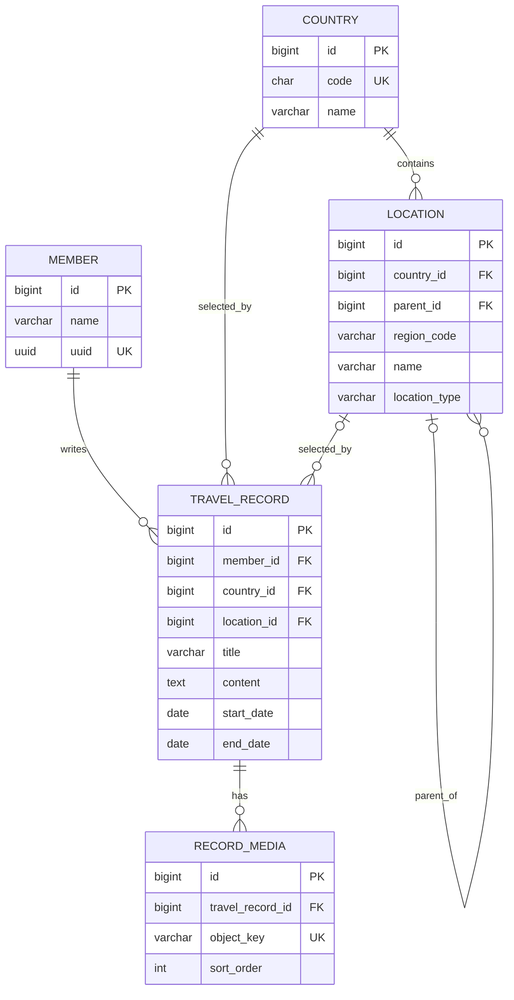

# ADR-0003: ERD 설계

## 날짜

2026-08-07

## 컨텍스트와 문제 정의

세계 지도에서는 해외 국가를, 대한민국 지도에서는 시·도와 시·군·구를 색칠한다. 해외는 국가 단위로 기록하지만 대한민국은 시·군·구에 기록하고, 하위 기록이 있으면 상위 시·도와 세계 지도의 대한민국도 색칠되어야 한다. 기록에는 여러 이미지를 순서대로 연결해야 한다.

## 고려한 옵션들

| 옵션 | 설명 |
| --- | --- |
| 국가와 행정구역을 하나의 테이블로 통합 | 모든 지리 단위를 부모-자식 관계로 표현한다. |
| **`country`와 `location` 분리** | 국가와 대한민국 행정구역을 분리하고, 지역만 계층으로 관리한다. |
| 좌표·주소 중심 저장 | 행정구역 대신 위경도와 역지오코딩 결과를 기록한다. |
| 방문 상태 별도 테이블 | 지도 색칠 결과를 기록과 별도로 저장·갱신한다. |

## 결정 근거

- ISO 국가 코드와 대한민국 행정구역 코드는 서로 다른 식별 체계다.
- `location.parent_id`는 시·도 → 시·군·구 탐색과 상위 지역 집계를 지원한다.
- `travel_record.location_id`만으로는 해외 국가 단위 기록을 표현할 수 없어 `country_id`가 필요하다.
- 방문 상태를 별도로 저장하지 않고 여행 기록을 집계하면 생성·수정·삭제 시 색칠 상태의 정합성을 유지하기 쉽다.
- 이미지 바이너리는 S3에 두고 DB에는 객체 키와 순서만 두면 데이터베이스를 메타데이터 중심으로 유지할 수 있다.

## 결정 사항

| 테이블 | 역할 |
| --- | --- |
| `member` | 여행 기록 소유자 |
| `country` | ISO 3166-1 alpha-2 국가 정보 |
| `location` | 대한민국 `PROVINCE → DISTRICT` 행정구역 |
| `travel_record` | 회원의 해외 국가 또는 국내 시·군·구 기록 |
| `record_media` | 기록에 연결된 S3 객체 키와 노출 순서 |

모든 테이블에는 `created_at`, `updated_at`을 `DATETIME(6) NOT NULL`로 둔다.

## 장단점

| 장점 | 단점 |
| --- | --- |
| 해외 국가 기록과 국내 상세 지역 기록을 모두 일관되게 표현한다. | 해외 행정구역 기록을 추가하려면 모델을 확장해야 한다. |
| 시·도·국가 색칠을 기록 집계로 정확하게 계산한다. | 지도 조회에 집계 쿼리가 필요하다. |
| S3 파일과 DB 메타데이터를 분리하고 이미지 순서를 보장한다. | 업로드 객체의 소유권·고아 객체 정리는 서비스·S3 정책으로 관리해야 한다. |

무결성 규칙은 다음과 같다.

- `country.code`는 UNIQUE, `location`에는 `UNIQUE(country_id, region_code)`를 둔다.
- 모든 기록은 `country_id`를 가진다. 해외 기록은 `location_id = NULL`, 대한민국 기록은 같은 국가의 `DISTRICT location_id`를 가진다.
- 대한민국 국가 단위 기록, `PROVINCE` 직접 기록, 해외 행정구역 기록은 MVP에서 허용하지 않는다.
- `record_media.object_key`는 UNIQUE이며, 기록 삭제 시 `record_media`는 CASCADE 삭제한다.
- `country`·`location`은 참조 중이면 삭제하지 않는다(RESTRICT).
