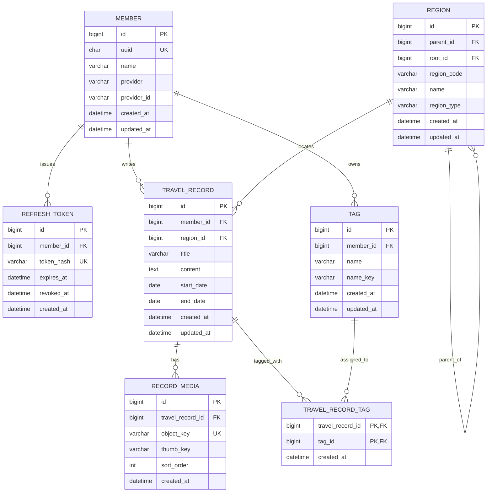

# Mapmory ERD

> 기준일: 2026-08-20 · 기준 스키마: Flyway V1~V14 + 사용자 생성 태그 구현 전 설계

이 문서는 현재 운영 스키마와 다음 구현 대상인 태그 스키마를 함께 보여준다.

- `구현됨`: 현재 Flyway 마이그레이션과 JPA 모델에 존재한다.
- `구현 전 설계`: API·ERD 합의 후 새 Flyway 마이그레이션으로 추가한다.

## ERD



## 테이블 상태와 역할

| 상태 | 테이블 | 역할 |
| --- | --- | --- |
| 구현됨 | `member` | 회원과 소셜 로그인 식별 정보를 저장한다. |
| 구현됨 | `refresh_token` | 회전 가능한 Refresh Token의 SHA-256 해시와 만료·폐기 시각을 저장한다. |
| 구현됨 | `region` | 국가와 행정구역을 하나의 계층으로 관리한다. |
| 구현됨 | `travel_record` | 회원이 선택한 국가 또는 최종 행정구역에 남기는 기록이다. |
| 구현됨 | `record_media` | S3 객체 키, 썸네일 키, 노출 순서를 보관한다. |
| 구현 전 설계 | `tag` | 회원이 만든 개인 태그를 저장한다. |
| 구현 전 설계 | `travel_record_tag` | 여행 기록과 태그의 다대다 관계를 저장한다. |

## 현재 구현 스키마

### `member`

| 컬럼 | 타입 | 제약조건 | 설명 |
| --- | --- | --- | --- |
| `id` | `BIGINT` | PK, AUTO_INCREMENT | 내부 회원 식별자 |
| `uuid` | `CHAR(36)` | NOT NULL, UNIQUE | 외부 노출용 회원 식별자 |
| `name` | `VARCHAR(50)` | NOT NULL | 회원 표시 이름 |
| `provider` | `VARCHAR(20)` | NULL | `KAKAO` 등 소셜 로그인 제공자 |
| `provider_id` | `VARCHAR(255)` | NULL | 소셜 제공자가 발급한 회원 식별자 |
| `created_at` | `DATETIME` | NOT NULL | 생성 시각 |
| `updated_at` | `DATETIME` | NOT NULL | 마지막 수정 시각 |

`UNIQUE(provider, provider_id)`로 같은 소셜 계정의 중복 가입을 막는다. V11의 임시 회원을 보존하기 위해 두 소셜 로그인 컬럼은 현재 NULL을 허용한다.

### `refresh_token`

| 컬럼 | 타입 | 제약조건 | 설명 |
| --- | --- | --- | --- |
| `id` | `BIGINT` | PK, AUTO_INCREMENT | Refresh Token 식별자 |
| `member_id` | `BIGINT` | NOT NULL, FK → `member.id` | 토큰 소유 회원 |
| `token_hash` | `VARCHAR(64)` | NOT NULL, UNIQUE | 원문이 아닌 SHA-256 해시 |
| `expires_at` | `DATETIME` | NOT NULL | 만료 시각 |
| `revoked_at` | `DATETIME` | NULL | 회전 또는 로그아웃으로 폐기된 시각 |
| `created_at` | `DATETIME` | NOT NULL | 생성 시각 |

`INDEX(member_id)`로 회원의 토큰 일괄 폐기 조회를 지원한다.

### `region`

| 컬럼 | 타입 | 제약조건 | 설명 |
| --- | --- | --- | --- |
| `id` | `BIGINT` | PK, AUTO_INCREMENT | Region 식별자 |
| `parent_id` | `BIGINT` | NULL, FK → `region.id` | 직속 상위 Region |
| `root_id` | `BIGINT` | NULL, FK → `region.id` | 하위 Region이 속한 국가 Region |
| `region_code` | `VARCHAR(20)` | NOT NULL | Region 타입별 원본 표준 코드 |
| `name` | `VARCHAR(100)` | NOT NULL | 표시 이름 |
| `region_type` | `VARCHAR(20)` | NOT NULL | `COUNTRY`, `PROVINCE`, `DISTRICT` |
| `created_at` | `DATETIME` | NOT NULL | 생성 시각 |
| `updated_at` | `DATETIME` | NOT NULL | 마지막 수정 시각 |

#### Region 계층과 코드

| `region_type` | `parent_id` | `root_id` | `region_code` 체계 |
| --- | --- | --- | --- |
| `COUNTRY` | `NULL` | `NULL` | ISO 3166-1 alpha-2 |
| `PROVINCE` | 국가 Region | 국가 Region ID | ISO 3166-2 지역 코드 |
| `DISTRICT` | 시·도 Region | 국가 Region ID | 행정표준코드 |

계층은 코드 접두사가 아닌 `parent_id`로만 판단한다. `root_id`는 국가별 필터와 집계를 빠르게 처리하기 위한 보조 컬럼이다.

현재 인덱스:

- `INDEX(parent_id)`
- `INDEX(root_id)`

현재 스키마는 Region 코드의 중복을 데이터베이스 UNIQUE로 차단하지 않는다. 애플리케이션은 `(parent_id, region_type, region_code)`가 한 행을 식별한다고 가정하므로 별도 마이그레이션에서 유일성 제약 추가 여부를 결정해야 한다.

### `travel_record`

| 컬럼 | 타입 | 제약조건 | 설명 |
| --- | --- | --- | --- |
| `id` | `BIGINT` | PK, AUTO_INCREMENT | 여행 기록 식별자 |
| `member_id` | `BIGINT` | NOT NULL, FK → `member.id` | 기록 소유 회원 |
| `region_id` | `BIGINT` | NOT NULL, FK → `region.id` | 기록 대상 Region |
| `title` | `VARCHAR(200)` | NOT NULL | 제목, 빈 문자열 허용 |
| `content` | `TEXT` | NOT NULL | 본문, 빈 문자열 허용 |
| `start_date` | `DATE` | NOT NULL | 여행 시작일 |
| `end_date` | `DATE` | NULL | 여행 종료일 |
| `created_at` | `DATETIME` | NOT NULL | 생성 시각 |
| `updated_at` | `DATETIME` | NOT NULL | 마지막 수정 시각 |

- 해외 기록은 `COUNTRY` Region을 참조한다.
- 대한민국 기록은 `DISTRICT` Region을 참조한다.
- Region 타입과 계층 유효성은 서비스에서 검증한다.
- `INDEX(member_id, region_id)`로 회원별 지역 필터와 지도 집계를 지원한다.

### `record_media`

| 컬럼 | 타입 | 제약조건 | 설명 |
| --- | --- | --- | --- |
| `id` | `BIGINT` | PK, AUTO_INCREMENT | 미디어 식별자 |
| `travel_record_id` | `BIGINT` | NOT NULL, FK → `travel_record.id` | 소속 여행 기록 |
| `object_key` | `VARCHAR(500)` | NOT NULL, UNIQUE | 원본 S3 객체 키 |
| `thumb_key` | `VARCHAR(500)` | NULL | 썸네일 S3 객체 키 |
| `sort_order` | `INT` | NOT NULL, DEFAULT 0 | 노출 순서 |
| `created_at` | `DATETIME` | NOT NULL | 생성 시각 |

여행 기록 삭제 시 `ON DELETE CASCADE`로 메타데이터를 함께 삭제한다. S3 실제 객체는 데이터베이스 CASCADE로 삭제되지 않는다.

## 사용자 생성 태그 스키마 — 구현 전 설계

### 핵심 결정

- 태그는 `member`가 소유한다.
- 여행 기록과 태그는 다대다 관계다.
- 태그에 Region을 직접 연결하지 않는다.
- 태그별 지도 영역은 `travel_record_tag → travel_record.region_id`를 집계해 계산한다.
- 태그마다 별도의 `map` 행을 만들지 않는다. 공유·멤버십·공개 범위가 필요해질 때 `map` 도메인을 별도로 검토한다.

### `tag`

| 컬럼 | 타입 | 제약조건 | 설명 |
| --- | --- | --- | --- |
| `id` | `BIGINT` | PK, AUTO_INCREMENT | 태그 식별자 |
| `member_id` | `BIGINT` | NOT NULL, FK → `member.id` | 태그 소유 회원 |
| `name` | `VARCHAR(30)` | NOT NULL | 화면에 표시할 이름, `#` 제외 |
| `name_key` | `VARCHAR(30)` | NOT NULL | 이름 중복 판단용 키 |
| `created_at` | `DATETIME` | NOT NULL | 생성 시각 |
| `updated_at` | `DATETIME` | NOT NULL | 마지막 수정 시각 |

권장 제약조건:

```sql
CONSTRAINT fk_tag_member
    FOREIGN KEY (member_id) REFERENCES member (id),
CONSTRAINT uk_tag_member_name_key
    UNIQUE (member_id, name_key)
```

`name`은 앞뒤 공백 제거, 연속 공백 축약, Unicode NFC를 적용하되 사용자가 입력한 대소문자는 보존한다. `name_key`는 `name`을 소문자로 변환한 이름 중복 판단용 키다. 같은 회원 안에서만 유일하며 다른 회원은 같은 이름을 사용할 수 있다. 회원별 태그는 임시로 최대 10개이므로 `created_at` 정렬 전용 인덱스는 두지 않고, 조회 시 데이터베이스가 최대 10개 행을 정렬하도록 한다.

### `travel_record_tag`

| 컬럼 | 타입 | 제약조건 | 설명 |
| --- | --- | --- | --- |
| `id` | `BIGINT` | PK, AUTO_INCREMENT | 여행 기록-태그 연결 식별자 |
| `travel_record_id` | `BIGINT` | NOT NULL, FK → `travel_record.id` | 여행 기록 식별자 |
| `tag_id` | `BIGINT` | NOT NULL, FK → `tag.id` | 태그 식별자 |
| `created_at` | `DATETIME` | NOT NULL | 연결 생성 시각 |

권장 제약조건:

```sql
PRIMARY KEY (id),
CONSTRAINT uk_travel_record_tag_tag_record
    UNIQUE (tag_id, travel_record_id),
CONSTRAINT fk_travel_record_tag_record
    FOREIGN KEY (travel_record_id) REFERENCES travel_record (id)
    ON DELETE CASCADE,
CONSTRAINT fk_travel_record_tag_tag
    FOREIGN KEY (tag_id) REFERENCES tag (id)
    ON DELETE CASCADE
```

단일 PK는 JPA 엔티티 식별을 단순하게 유지한다. `(tag_id, travel_record_id)` UNIQUE 제약조건은 같은 기록에 동일한 태그가 중복 연결되는 것을 차단하며, 태그별 기록 목록과 지도 집계에서는 커버링 인덱스로 활용할 수 있다. MySQL InnoDB는 `travel_record_id`로 시작하는 인덱스가 없으므로 해당 외래 키를 위한 인덱스를 자동 생성한다.

데이터베이스 외래 키만으로는 기록과 태그가 같은 회원 소유인지 보장하지 못한다. 서비스는 연결 전에 요청한 모든 태그를 `member_id`로 한 번에 조회하고, 조회된 고유 ID 수가 요청 ID 수와 같은지 검증해야 한다. 검증과 연결 저장은 여행 기록 생성·수정 트랜잭션 안에서 수행한다.

## 관계 및 삭제 정책

- `member` 1 : N `refresh_token`
- `member` 1 : N `travel_record`
- `member` 1 : N `tag`
- `region` 1 : N `region`
- `region` 1 : N `travel_record`
- `travel_record` 1 : N `record_media`
- `travel_record` N : M `tag`
- 여행 기록 삭제 시 `record_media`, `travel_record_tag`를 CASCADE 삭제한다.
- 태그 삭제 시 `travel_record_tag`만 CASCADE 삭제하며 여행 기록은 유지한다.
- 회원 탈퇴 정책은 아직 확정되지 않았으므로 회원 관련 외래 키의 삭제 정책은 별도 ADR에서 결정한다.
- 참조 중인 Region은 삭제하지 않는다. 행정구역 개편은 이력·코드 변경 정책으로 처리한다.

## 태그 기능 한도와 후속 범위

- 회원당 태그 최대 10개
- 기록당 태그 최대 5개
- 두 제한은 MVP 사용성 검증을 위한 임시 정책이며 사용자 테스트와 실제 사용 분포를 확인한 뒤 재결정
- MVP 지도 필터는 단일 `tagId`만 지원
- 여러 태그의 `ANY`/`ALL` 검색은 후속 범위
- 태그 색상·아이콘·정렬·공유는 후속 범위
- 집계 성능을 측정하기 전에는 태그–Region 집계 캐시 테이블을 추가하지 않음

## 구현 순서

1. API·ERD 리뷰와 태그 이름 정책 확정
2. `tag`, `travel_record_tag` Flyway 마이그레이션 추가
3. 태그 엔티티·Repository·CRUD API 구현
4. 여행 기록 생성·수정·목록·상세에 태그 연결 추가
5. 여행 기록 목록과 지도 요약에 단일 `tagId` 필터 추가
6. MySQL Testcontainers로 유일성·CASCADE·집계 쿼리 검증
7. KMP API DTO와 태그 선택 UI 연결
