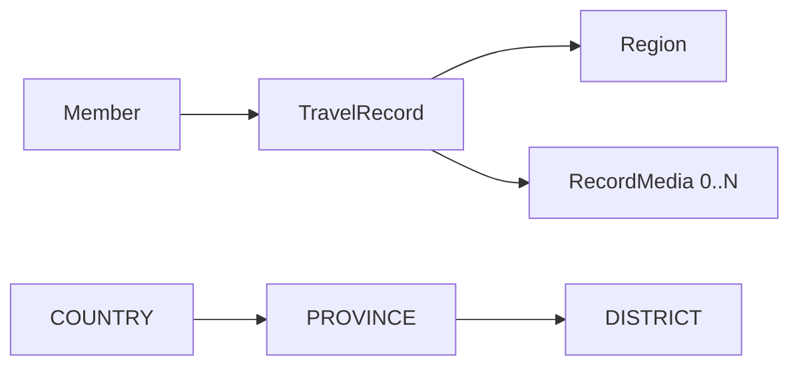

# 여행 기록 저장 및 조회 방식

> 기준일: 2026-08-16 · 현재 구현된 생성, 목록 및 상세 조회 기준

## 1. 목적

여행 기록은 해외에서는 국가 단위로, 대한민국에서는 시·군·구 단위로 저장한다. 국가와 행정구역은 모두 `region` 테이블에 저장하며, 여행 기록은 최종 선택된 `region_id` 하나만 참조한다.



## 2. 관련 테이블

| 테이블 | 여행 기록 기능에서의 역할 |
| --- | --- |
| `member` | 여행 기록 작성자 |
| `region` | 국가·시도·시군구 계층과 코드 보관 |
| `travel_record` | 작성자, 최종 Region, 제목, 본문, 여행 날짜 보관 |
| `record_media` | 여행 기록에 연결된 이미지 Object Key와 노출 순서 보관 |

### 주요 관계

| 관계 | 컬럼 | 필수 여부 |
| --- | --- | --- |
| 여행 기록 → 회원 | `travel_record.member_id` | 필수 |
| 여행 기록 → 선택 지역 | `travel_record.region_id` | 필수 |
| 미디어 → 여행 기록 | `record_media.travel_record_id` | 필수 |
| Region → 직접 부모 | `region.parent_id` | COUNTRY는 `NULL` |
| Region → 국가 루트 | `region.root_id` | COUNTRY는 `NULL` |

## 3. Region 데이터 구조

| id | parent_id | root_id | region_code | region_type | name |
| ---: | ---: | ---: | --- | --- | --- |
| 1 | `NULL` | `NULL` | `KR` | `COUNTRY` | 대한민국 |
| 2 | 1 | 1 | `49` | `PROVINCE` | 제주특별자치도 |
| 3 | 2 | 1 | `50110` | `DISTRICT` | 제주시 |
| 4 | `NULL` | `NULL` | `JP` | `COUNTRY` | 일본 |

- `parent_id`는 직접 부모를 나타낸다.
- `root_id`는 해당 Region이 속한 국가 ID다.
- 계층은 코드 접두사가 아니라 `parent_id`로만 판단한다.

## 4. 여행 기록 생성

### 요청에서 DB 저장까지

```text
Controller
  → X-Member-Id와 TravelRecordRequest 수신
Service
  → 회원 참조 조회
  → 국가 → 시도 → 시군구 순서로 Region 조회
  → TravelRecord 저장
  → objectKeys 순서대로 RecordMedia 저장
Controller
  → 저장된 TravelRecord를 생성 응답 DTO로 변환
  → 성공 응답을 data 필드로 감싸 반환
```

### 계층별 Region 선택

| 요청 | Region 탐색 | `travel_record.region_id` |
| --- | --- | --- |
| `countryCode=JP` | 부모가 없는 `COUNTRY JP` 조회 | 일본 Region ID |
| `countryCode=KR`, `provinceCode=49`, `districtCode=50110` | 대한민국 → 제주 → 제주시 순서로 조회 | 제주시 Region ID |

국내 기록 예시:

```json
{
  "countryCode": "KR",
  "provinceCode": "49",
  "districtCode": "50110",
  "title": "제주 여행",
  "content": "제주시를 걸었다.",
  "startDate": "2026-08-11",
  "endDate": null,
  "objectKeys": [
    "travel-records/1/a.jpg",
    "travel-records/1/b.jpg"
  ]
}
```

저장 결과 예시:

| 테이블 | 저장 내용 |
| --- | --- |
| `travel_record` | `member_id=1`, `region_id=제주시 ID`, 제목·본문·날짜 |
| 첫 번째 `record_media` | `object_key=a.jpg`, `sort_order=0` |
| 두 번째 `record_media` | `object_key=b.jpg`, `sort_order=1` |

여행 기록과 미디어 저장은 하나의 트랜잭션에서 실행한다. 중간 저장이 실패하면 전체 작업이 롤백된다.

## 5. 여행 기록 목록 조회

목록 API는 Controller 하나에서 선택 Query Parameter를 받는다. 국가·시도·시군구마다 별도 Controller를 만들지 않는다.

```http
GET /api/v1/travel-records
GET /api/v1/travel-records?countryCode=KR
GET /api/v1/travel-records?countryCode=KR&provinceCode=49
GET /api/v1/travel-records?countryCode=KR&provinceCode=49&districtCode=50110
```

### 필터별 조회 조건

| 전달된 필터 | 기준 Region | Repository 조회 조건 |
| --- | --- | --- |
| 없음 | 없음 | `member_id` 일치 |
| 국가 | `COUNTRY` | `region.id = countryId OR region.root.id = countryId` |
| 시도 | `PROVINCE` | `region.id = provinceId OR region.parent.id = provinceId` |
| 시군구 | `DISTRICT` | `region.id = districtId` |

### 요청 검증과 예외 처리

목록 조회는 Repository 호출 전에 다음 조건을 검증한다.

| 조건 | 응답 |
| --- | --- |
| `X-Member-Id` 누락·형식 오류·0 이하 | `400 VALIDATION_ERROR` |
| 회원이 존재하지 않음 | `404 MEMBER_NOT_FOUND` |
| `provinceCode`에 `countryCode`가 없음 | `400 REGION_REQUIRED` |
| `districtCode`에 `countryCode` 또는 `provinceCode`가 없음 | `400 REGION_REQUIRED` |
| 지역 코드 형식 오류, `page < 0`, `size`가 1 미만 또는 100 초과 | `400 VALIDATION_ERROR` |
| 국가·시도·시군구 코드가 존재하지 않음 | `404 REGION_NOT_FOUND` |
| 요청한 시도·시군구가 선택한 상위 Region의 직계 자식이 아님 | `400 INVALID_REGION_HIERARCHY` |

지역 경로 탐색과 계층 예외 변환은 `RegionResolver`가 담당한다. 시도·시군구의 소속 관계는 코드 접두사가 아닌 `parent_id`로 확인한다.

조건에 맞는 여행 기록이 없으면 오류 없이 `200 OK`와 빈 목록을 반환한다.

### 국가 필터 예시

대한민국 ID가 `1`이고 제주시의 `root_id`가 `1`이면, 다음 두 종류가 대한민국 목록에 포함된다.

```text
travel_record.region_id = 1       // 대한민국 자체 기록
travel_record.region.root_id = 1  // 대한민국 하위 지역 기록
```

JPQL은 다음 의미로 사용한다.

```java
WHERE tr.member.id = :memberId
  AND (
      tr.region.id = :countryId
      OR tr.region.root.id = :countryId
  )
```

### 시도 필터 예시

제주특별자치도 ID가 `2`이면 제주 자체 기록과 부모가 제주인 시군구 기록을 조회한다.

```java
WHERE tr.member.id = :memberId
  AND (
      tr.region.id = :provinceId
      OR tr.region.parent.id = :provinceId
  )
```

### 시군구 필터 예시

제주시 ID가 `3`이면 해당 Region에 직접 연결된 기록만 조회한다.

```text
member_id = 요청 회원 ID
region_id = 3
```

## 6. 페이징과 응답

Service는 `PageRequest`를 이용해 최신 생성순으로 조회한다.

```java
PageRequest.of(
        page,
        size,
        Sort.by(Sort.Direction.DESC, "createdAt")
)
```

| 응답 필드 | 의미 |
| --- | --- |
| `items` | 현재 페이지의 여행 기록 요약 목록 |
| `page` | 현재 페이지 번호 |
| `size` | 페이지 크기 |
| `totalElements` | 조건에 맞는 전체 기록 수 |
| `totalPages` | 전체 페이지 수 |
| `hasNext` | 다음 페이지 존재 여부 |

목록 아이템은 `id`, `title`, `regionName`, `startDate`, `endDate`, `thumbnailUrl`만 반환한다. 본문과 전체 이미지 목록은 목록 응답에서 제외한다.

생성과 목록 조회의 성공 응답은 다음처럼 `data` 필드로 감싼다.

```json
{
  "data": {
    "id": 101
  }
}
```

오류 응답은 성공 응답 래퍼를 사용하지 않고 RFC 9457 Problem Details 구조를 유지한다.

## 7. 계층별 책임

| 계층 | 책임 |
| --- | --- |
| Controller | HTTP 헤더·Query Parameter 수신, 응답 DTO 변환 |
| Service | Region 경로 결정, 저장 흐름과 조회 분기, 트랜잭션 관리 |
| Repository | 회원·Region 조건에 맞는 DB 조회 및 페이징 |
| Entity | 테이블 매핑과 연관관계 표현 |
| DTO | API 요청·응답 데이터 표현 |

## 8. 여행 기록 상세 조회

상세 조회는 요청 회원이 소유한 기록만 반환한다.

```http
GET /api/v1/travel-records/{travelRecordId}
X-Member-Id: 10
```

Repository에서 `travelRecordId`와 `memberId`를 함께 조건으로 사용한다. 기록이 없거나 다른 회원의 기록인 경우 모두 `404 TRAVEL_RECORD_NOT_FOUND`를 반환하여 기록의 존재 여부가 노출되지 않게 한다.

응답에는 제목, 본문, 여행 날짜, 국가·시도·시군구 계층, 생성·수정 시각을 포함한다. 기존 저장·수정 계약을 위한 `objectKeys`와 함께, `sort_order` 오름차순으로 조회 가능한 Presigned GET URL을 담은 `media`를 반환한다.

```json
{
  "data": {
    "id": 101,
    "title": "제주 여행",
    "content": "제주시를 걸었다.",
    "region": {
      "country": {"code": "KR", "name": "대한민국"},
      "province": {"code": "49", "name": "제주특별자치도"},
      "district": {"code": "50110", "name": "제주시"}
    },
    "startDate": "2026-08-11",
    "endDate": "2026-08-13",
    "objectKeys": [
      "mapmory/travel-records/a.jpg",
      "mapmory/travel-records/b.jpg"
    ],
    "media": [
      {
        "id": 1,
        "objectKey": "mapmory/travel-records/a.jpg",
        "viewUrl": "https://bucket.s3.ap-northeast-2.amazonaws.com/...?X-Amz-Signature=...",
        "viewUrlExpiresIn": 300,
        "sortOrder": 0
      }
    ],
    "createdAt": "2026-08-14T10:30:00",
    "updatedAt": "2026-08-15T09:00:00"
  }
}
```

국가 단위 기록은 `province`와 `district`가 `null`이다. `viewUrl`은 상세 응답을 만들 때마다 S3 Presigned GET URL로 생성하며, `viewUrlExpiresIn`은 초 단위 만료 시간이다. URL은 DB에 저장하지 않는다.

## 9. 여행 기록 수정

수정 API는 현재 회원이 소유한 기록을 생성 요청과 같은 본문으로 전체 수정한다.

```http
PUT /api/v1/travel-records/{travelRecordId}
X-Member-Id: 10
```

Service는 `travelRecordId`와 `memberId`로 소유권을 확인한 후 새 Region 경로를 조회한다. 기록이 없거나 다른 회원의 기록이면 모두 `404 TRAVEL_RECORD_NOT_FOUND`를 반환한다.

미디어는 전체 삭제 후 재생성하지 않고 기존 목록과 요청의 `objectKeys`를 비교한다.

| 구분 | 처리 |
| --- | --- |
| 기존과 요청에 모두 존재 | 기존 미디어를 유지하고 `sort_order` 변경 |
| 기존에만 존재 | `record_media` 삭제 |
| 요청에만 존재 | 새 `record_media` 생성 |
| 요청이 `null` 또는 빈 배열 | 기존 미디어 전체 삭제 |

중복 Object Key 또는 다른 여행 기록에서 이미 사용 중인 Object Key는 `400 INVALID_OBJECT_KEY`로 거부한다. Object Key의 회원 소유권과 S3 업로드 완료 여부 검증은 후속 작업이다.

수정 성공 시 변경된 여행 기록을 상세 조회와 같은 응답 구조로 반환한다. 기록과 미디어 변경은 하나의 트랜잭션에서 처리하므로 중간에 실패하면 전체 변경이 롤백된다.

## 10. 현재 후속 작업

| 항목 | 상태 |
| --- | --- |
| 여행 기록과 미디어 기본 저장 | 구현 |
| 전체·국가·시도·시군구 목록 조회 | 구현 |
| 생성·목록 페이징 테스트 | 구현 |
| 여행 기록 상세 조회 및 소유권 검사 | 구현 |
| 여행 기록 전체 수정 및 미디어 동기화 | 구현 |
| 목록 썸네일 URL 생성 | 미구현, 현재 `null` |
| 상세 조회 Object Key의 Presigned GET URL 변환 | 구현 |
| 키워드 검색 | 미구현 |
| 날짜 범위 검증 | 미구현 |
| Object Key 소유권·업로드 검증 | 미구현 |
| Region 미존재 도메인 예외 | 미구현 |
| 성공 응답 `data` 래퍼 | 구현 |

## 11. 관련 문서

- [API 명세](../../api.md)
- [ERD](erd.md)
- [ADR 0004: 지역 코드 체계와 계층 판단 방식](adr/0004-region-code-system.md)
- [ADR 0008: 국가와 행정구역을 Region 계층으로 통합](adr/0008-unify-country-and-location-as-region.md)
